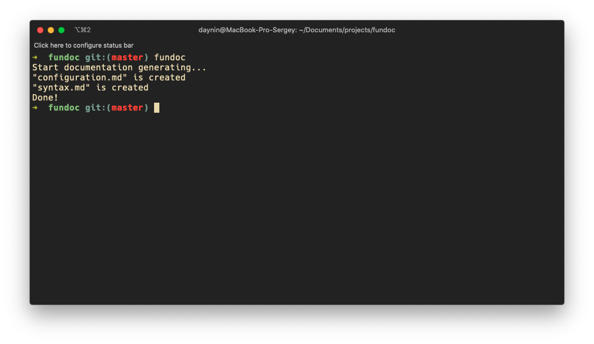

# Fundoc 
 [](https://travis-ci.org/daynin/fundoc) [](https://opensource.org/licenses/MIT) [](https://github.com/daynin/fundoc/issues)
-

**Fundoc** - the right way to generate documentation. A business feature in your project may be implemented in separated files and even in different technologies. Fundoc can merge all descriptions about business features and put in appropriate files.

Fundoc's main goals:

- Allow you to keep all your **documentation along with your code**. Separating documentation from code makes it harder to support.
- Use **same versioning tools for your documentation** as for your code. All versions of your documentation should match versions of source code otherwise we can't trust this documentation.
- A documentation generator should allow you to **write your doc-fragments in different kinds of files** like source code files (Rust, C++, TypeScript, Java, JavaScript, Ruby, Python, etc), specification files (Alloy, TLA+, etc), stylesheet files (CSS, SCSS, QT Stylesheets, etc), configs (JSON, TOML, YAML, etc).

<p align="center">
	
</p>

### Why you should use it

If you want to keep your documentation synchronised with your code and to be able to describe different parts of a business feature in in places where it was implemented, like:

`src/api/orders.rs`

```rust
// An API layer which implements "orders" in your system

fn get_orders(params: ReqParams) {
	/**
	 * @ Article Orders
	 *
	 * A description part of whole "orders" feature about logic of how to get them
	 * /
	...
	// Some code here
}
```

`src/utils/orders.rs`

```rust
// Utils functions for parsing/validating/etc orders

fn validate_order(order: Order) {
	/**
	 * @ Article Orders
	 *
	 * A description part of whole "orders" feature about their validation rules
	 * /
	...
	// Some code here
}
```

`orders.md`

```markdown
# Orders

A description part of whole "orders" feature about logic of how to get them [~](https://link-to-a-source-file.com/src/api/orders.rs)

A description part of whole "orders" feature about their validation rules [~](https://link-to-a-source-file.com/src/utils/rs)
```

### Installation

You can install fundoc by executing this shell script:

```bash
curl -LSfs https://japaric.github.io/trust/install.sh | \
    sh -s -- --git daynin/fundoc
```

If you're rust developer and you have had rust compiler installed, you can install fundoc from [crates.io](https://crates.io/):

```bash
cargo install fundoc
```

Or manually download it from the [releases page](https://github.com/daynin/fundoc/releases).

### How to use

Just create a config file (read configuration docs [here](./docs/configuration.md)), start to write docstrings in your files according to [fundoc's syntax](./docs/syntax.md), run `fundoc` to generate documentation:

<p align="center">
    
</p>


