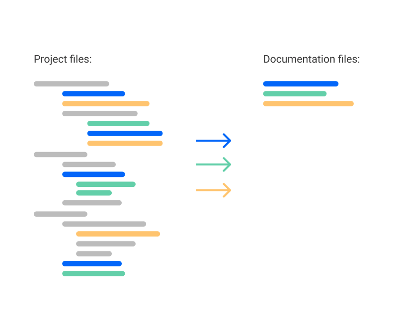
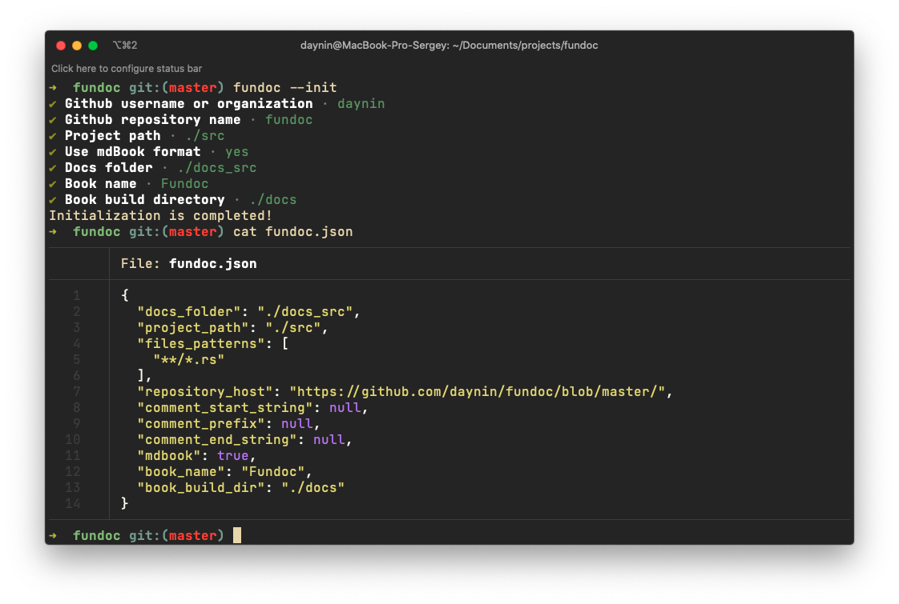

<p align="center">
  <a href="https://github.com/CSSSR/fundoc">
    
  </a>
</p>

<h2 align="center">
    Language agnostic documentation generator. Written in Rust 🦀
</h2>

<p align="center">
  <a href="https://travis-ci.org/CSSSR/fundoc">
    
  </a>
  <a href="https://opensource.org/licenses/MIT">
    
  </a>
  <a href="https://github.com/CSSSR/fundoc/issues">
    
  </a>
  <a href="https://crates.io/crates/fundoc">
    
  </a>
</p>

**Fundoc** - the right way to generate documentation. Business features in your project can be implemented in different files and even in different technologies. Fundoc can merge all descriptions of those features and put them in appropriate files.

Fundoc's main goals:

- Allow you to keep all your **documentation along with your code**. Separating documentation and code makes it harder to support projects.
- Use **the same versioning tools for your documentation** and code. All versions of your documentation should match versions of source code otherwise we can't trust documentation.
- Documentation generators should allow you to **write your documentation from different file types** like source code files (Rust, C++, TypeScript, Java, JavaScript, Ruby, Python, etc), specification files (Alloy, TLA+, etc), stylesheet files (CSS, SCSS, QT Stylesheets, etc), configs (JSON, TOML, YAML, etc).

<p align="center">
	
</p>

### Why you should use it

If you want to keep your documentation synchronised with your code and to be able to describe different parts of a business feature in places where it was implemented you can write documentation in your source files, like:

`src/api/orders.rs`

```rust
// An API layer which implements "orders" in your system

fn get_orders(params: ReqParams) {
	/**
	 * @Article Orders
	 *
	 * A description part of whole "orders" feature about logic of how to get them
	 */
	...
	// Some code here
}
```

`src/utils/orders.rs`

```rust
// Utils functions for parsing/validating/etc orders

fn validate_order(order: Order) {
	/**
	 * @Article Orders
	 *
	 * A description part of whole "orders" feature about their validation rules
	 */
	...
	// Some code here
}
```

`orders.md`

```markdown
# Orders

A description part of whole "orders" feature about logic of how to get them [~](https://link-to-a-source-file.com/src/api/orders.rs)

A description part of whole "orders" feature about their validation rules [~](https://link-to-a-source-file.com/src/utils/rs)
```

Or you can use .md files as well combining documentation from source files and from `.fdoc.md` files. In that case the name of an article will be got from a name of a file.

It can help you keep your documentation up to date and change only that part of the documentation that is connected to the code you're changing. And your team members can easily find the source of a documentation part using generated links on source files.

By the way, [documentation](./docs_src/) here is generated by fundoc itself, so you can check out how it works.

### Installation

You can install fundoc by executing this shell script:

```bash
curl -LSfs https://japaric.github.io/trust/install.sh | \
    sh -s -- --git CSSSR/fundoc
```

If you're rust developer and you have had rust compiler installed, you can install fundoc from [crates.io](https://crates.io/):

```bash
cargo install fundoc
```

Or manually download it from the [releases page](https://github.com/CSSSR/fundoc/releases).

### How to use

You can create a config file by executing `fundoc --init` command and answering few questions:

<p align="center">
    
</p>

All Fundoc's parameters are described [here](./docs_src/configuration.md)

To generate documenation run `fundoc` to generate documentation:

<p align="center">
    
</p>

Fundoc supports [mdBook](https://github.com/rust-lang/mdBook), so if you want to generate documentation in mdBook format you can do it by setting `mdBook: true` in your config file. It can be useful if you want to use GitHub Pages with full-text search support in your project.

<p align="center">
    
</p>

### GitHub Action

You can use [Fundoc's GitHub Action](https://github.com/CSSSR/fundoc-action) to automate documentation generation.

### Roadmap

- [x] Merging documentation from different files.
- [x] Different file types support.
- [x] Creating links to the source files from the documentation.
- [x] Generating mdBook with an ability to search through documentation.
- [ ] Multi-repositories support (collecting all documentation fragments from different repos).
- [ ] Zettelkasten method support (maybe)

